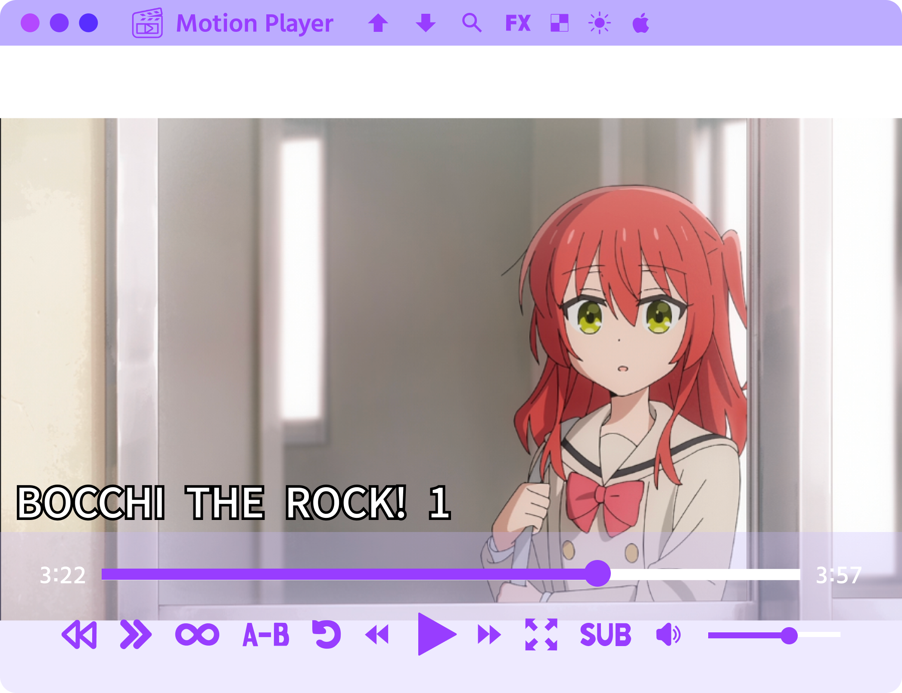

## Frame Player

A cute video player!

### Features:
- Play videos (MP4, MKV, WEBM, MOV)
- Play animations (GIF, WEBP, APNG, Pixiv Ugoira)
- Reversing effect
- Speed adjustment (can preserve or affect the pitch)
- Looping from point A to point B
- Video filters (brightness, contrast, saturation, pixelate, etc).
- Switch subtitle tracks and customize subtitles
- Switch audio tracks
- Jump to chapters
- Export videos and gifs with applied effects

### Keyboard Shortcuts:
- Space: Play/pause
- Left Arrow: Rewind
- Right Arrow: Fast forward
- Up Arrow: Increase volume
- Down Arrow: Decrease volume
- Mouse Wheel: Increase/decrease volume
- Ctrl O: Upload file
- Ctrl S: Download file

### Design

Our design is available here: https://www.figma.com/design/PpYPQAYojONPWedMbDRL8t/Frame-Player 

### Purchase

  

Linux version is free and available in [releases](https://github.com/Moebytes/Frame-Player/releases).

### See Also

- [Tune Player](https://github.com/Moebytes/Tune-Player)
- [Pic Display](https://github.com/Moebytes/Pic-Display)

